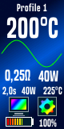

# dna75c

> My config and themes for the VT75c Vape Mod (DNA75C Chipset) ☁️ 🔋 🔧

## Configs

#### dualnife1

[Configuration for Dual Nife48 0,4mm Wire Coils with 6 Wicks](https://github.com/hobbyquaker/dna75c/raw/master/dualnife1.ecig)

## Themes

#### bla-theme1

[bla-theme1.ecigtheme](https://github.com/hobbyquaker/dna75c/raw/master/bla-theme1.ecigtheme)

* Profile
* Temperature Setting
* Power/Temperature Chart
* Cold Resistance, Maximum Power
* Last Puff Time, Last Puff Power, Last Puff Maximum Temperature
* Screen, Settings
* Battery Gauge, Battery Percentage

